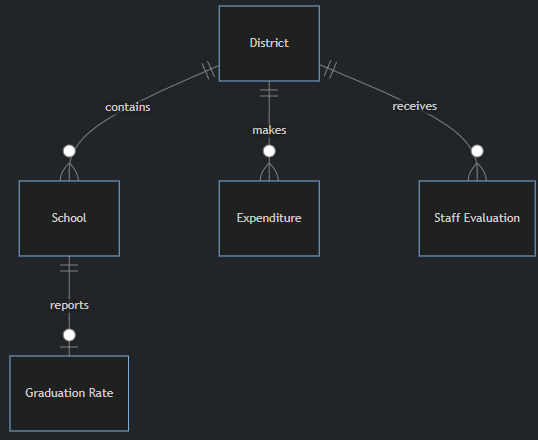

# DESE  
## Problem to Solve
You just landed a new job as a data analyst for the State of Massachusetts, working within the Department of Elementary and Secondary Education (or DESE, for short!). DESE oversees the state’s public education system. One responsibility of DESE is to ensure every child has a quality education—one in which they encounter experienced teachers, have access to an abundance of resources, and ultimately graduate having met all requirements of the state. Your SQL skills have a part to play in these lofty goals!

In a database called `dese.db`, answer questions about the state of education in Massachusetts.

## Schema
In Massachusetts, public education is delegated to districts, a type of school government often associated with an individual town. These districts, in turn, contain many individual schools. Consider the entity relationship diagram below, which codifies the relationship between districts, schools, and other data DESE collects.  
  
Within `dese.db`, you’ll find several tables that implement the relationships described in the diagram above. Click the drop-downs below to learn more about the schema of each individual table.
<details>
<summary>districts table</summary>
The `districts` table contains the following columns:

- `id`, which is the ID of the district
- `name`, which is the name of the district
- `type`, which denotes the type of district. In Massachusetts, there are public school districts (denoted “Public School District”) and charter districts (denoted “Charter District”). No need to learn the difference, though you can do so from Wikipedia if curious!
- `city`, which is the city in which the district is located
- `state`, which is the state in which the district is located
- `zip`, which is the ZIP Code in which the district is located
</details>

<details>
<summary>schools table</summary>
The `schools` table contains the following columns:

- `id`, which is the ID of the school
- `district_id`, which is the ID of the district to which the school belongs
- `name`, which is the name of the school
- `type`, which denotes the type of school. In Massachusetts, there are public schools (denoted “Public School”) and charter schools (denoted “Charter School”). No need to learn the difference, though you can do so from Wikipedia if curious!
- `city`, which is the city in which the school is located
- `state`, which is the state in which the school is located
- `zip`, which is the ZIP Code in which the school is located
</details>

<details>
<summary>graduation_rates table</summary>
The `graduation_rates` table contains the following columns:

- `id`, which is the ID of the graduation rate
- `school_id`, which is the ID of the school with which the graduation is associated
- `graduated`, which is the percentage of students, 0–100, who graduated on time
- `dropped`, which is the percentage of students, 0–100, who dropped out of school before graduation
- `excluded`, which is the percentage of students, 0–100, who were “excluded” (i.e., expelled)
</details>

<details>
<summary>expenditures table</summary>
The `expenditures` table contains the following columns:

- `id`, which is the ID of the expenditure
- `district_id`, which is the ID of the district with which the expenditure is associated
- `pupils`, which is the number of pupils attending the given district
- `per_pupil_expenditure`, which is the amount of money spent, in dollars, on each student attending the district
</details>

<details>
<summary>staff_evaluations table</summary>
The `staff_evaluations` table contains the following columns:

- `id`, which is the ID of the evaluation report
- `district_id`, which is the ID of the district with which the evaluation is associated
- `evaluated`, which is the percentage of district staff, 0–100, formally evaluated
- `exemplary`, which is the percentage of district staff, 0–100, evaluated as “exemplary”
- `proficient`, which is the percentage of district staff, 0–100, evaluated as “proficient”
- `needs_improvement`, which is the percentage of district staff, 0–100, evaluated as “needing improvement”
- `unsatisfactory`, which is the percentage of district staff, 0–100, evaluated as “unsatisfactory”
</details>
You might (cleverly!) note that some of these relationships could be implemented with a single table. You’d be correct, though in this case, you’ll simply have to work with what your colleagues at DESE created!

## Specification
For each of the following questions, you should write a single SQL query that outputs the results specified by each problem. Your response must take the form of a single SQL query. You should not assume anything about the `id`s of any particular rows: your queries should be accurate even if the `id`s were different. Finally, each query should return only the data necessary to answer the question.

`1.sql`  
Your colleague is preparing a map of all public schools in Massachusetts. In `1.sql`, write a SQL query to find the names and cities of all public schools in Massachusetts.

Keep in mind that not all schools in the schools table are considered traditional public schools. Massachusetts also recognizes charter schools, which (according to DESE!) are considered distinct.

`2.sql`  
Your team is working on archiving old data. In `2.sql`, write a SQL query to find the names of districts that are no longer operational.

- Districts that are no longer operational have “(non-op)” at the end of their name.

`3.sql`  
The Massachusetts Legislature would like to learn how much money, on average, districts spent per-pupil last year. In `3.sql`, write a SQL query to find the average per-pupil expenditure. Name the column “Average District Per-Pupil Expenditure”.

- Note the per_pupil_expenditure column in the expenditures table contains the average amount, per pupil, each district spent last year. You’ve been asked to find the average of this set of averages, weighting all districts equally regardless of their size.

`4.sql`  
Some cities have more public schools than others. In `4.sql`, write a SQL query to find the 10 cities with the most public schools. Your query should return the names of the cities and the number of public schools within them, ordered from greatest number of public schools to least. If two cities have the same number of public schools, order them alphabetically.

`5.sql`  
DESE would like you to determine in what cities additional public schools might be needed. In `5.sql`, write a SQL query to find cities with 3 or fewer public schools. Your query should return the names of the cities and the number of public schools within them, ordered from greatest number of public schools to least. If two cities have the same number of public schools, order them alphabetically.

`6.sql`  
DESE wants to assess which schools achieved a 100% graduation rate. In `6.sql`, write a SQL query to find the names of schools (public or charter!) that reported a 100% graduation rate.

`7.sql`  
DESE is preparing a report on schools in the Cambridge school district. In `7.sql`, write a SQL query to find the names of schools (public or charter!) in the Cambridge school district. Keep in mind that Cambridge, the city, contains a few school districts, but DESE is interested in the district whose name is “Cambridge.”

`8.sql`  
A parent wants to send their child to a district with many other students. In `8.sql`, write a SQL query to display the names of all school districts and the number of pupils enrolled in each.

`9.sql`  
Another parent wants to send their child to a district with few other students. In `9.sql`, write a SQL query to find the name (or names) of the school district(s) with the single least number of pupils. Report only the name(s).

`10.sql`  
In Massachusetts, school district expenditures are in part determined by local taxes on property (e.g., home) values. In `10.sql`, write a SQL query to find the 10 public school districts with the highest per-pupil expenditures. Your query should return the names of the districts and the per-pupil expenditure for each.

`11.sql`  
Is there a relationship between school expenditures and graduation rates? In `11.sql`, write a SQL query to display the names of schools, their per-pupil expenditure, and their graduation rate. Sort the schools from greatest per-pupil expenditure to least. If two schools have the same per-pupil expenditure, sort by school name.

- You should assume a school spends the same amount per-pupil their district as a whole spends.

`12.sql`  
A parent asks you for advice on finding the best public school districts in Massachusetts. In `12.sql`, write a SQL query to find public school districts with above-average per-pupil expenditures and an above-average percentage of teachers rated “exemplary”. Your query should return the districts’ names, along with their per-pupil expenditures and percentage of teachers rated exemplary. Sort the results first by the percentage of teachers rated exemplary (high to low), then by the per-pupil expenditure (high to low).
<details>
<summary>Hint</summary>
You might find it helpful to know that subqueries can be inserted into most any part of a SQL query, including conditions. For instance, the following is valid SQL syntax:   

```
SELECT "column" FROM "table"
WHERE "column" > (
    SELECT AVG("column")
    FROM "table"
);
````
</details>

`13.sql`  
In `13.sql`, write a SQL query to answer a question you have about the data! The query should:

- Involve at least one `JOIN` or subquery