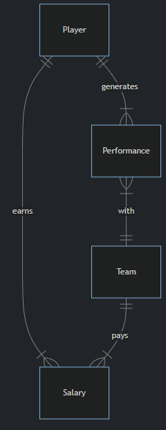

## Moneyball
### Problem to Solve
The year is 2001. You’ve been hired to help make the most of the Oakland Athletics baseball team’s dwindling player budget. Each year, teams like the “A’s” hire new baseball players. Unfortunately, you’re low on star players—and on funds. Though, with a bit of SQL and some luck, who says you can’t still create a team that defies expectations?

Given a database called `moneyball.db`—one that contains information on players, their performances, and their salaries—help the Oakland Athletics find the value in players others might miss.  

### Schema
`moneyball.db` represents all of Major League Baseball’s players, teams, salaries, and performances up until 2001. In particular, `moneyball.db` represents the following entities:

- A player, which includes anyone who’s played Major League Baseball for any amount of time
- A team, which includes all teams, past and present, in Major League Baseball
- A performance, which describes the types of hits a player made for their team in a given year
- A salary, which is the amount of money a team paid one of their players in a given year  

These entities are related per the entity relationship (ER) diagram below:

Within `moneyball.db`, you’ll find several tables that implement the relationships described in the ER diagram above. Click the drop-downs below to learn more about the schema of each individual table.

players table

The `players` table contains the following columns:  

- `id`, which is the ID of the player
- `first_name`, which is the first name of the player
- `last_name`, which is the last name of the player
- `bats`, which is the side (“R” for right or “L” for left) the player bats on
- `throws`, which is the hand (“R” for right or “L” for left) the player throws with
- `weight`, which is the player’s weight in pounds
- `height`, which is the player’s height in inches
- `debut`, which is the date (expressed as YYYY-MM-DD) the player began their career in the MLB
- `final_game`, which is the date (expressed as YYYY-MM-DD) the player played their last game in the MLB
- `birth_year`, which is the year the player was born
- `birth_month`, which is the month (expressed as an integer) the player was born
- `birth_day`, which is the day the player was born
- `birth_city`, which is the city in which the player was born
- `birth_state`, which is the state in which the player was born
- `birth_country`, which is the country in which the player was born

teams table

The `teams` table contains the following columns:

- `id`, which is the ID of each team
- `year`, which is the year the team was founded
- `name`, which is the name of the team
- `park`, which is name of the park at which the team plays (or played)

performances table

The `performances` table contains the following columns:

- `id`, which is the ID of the performance
- `player_id`, which is the ID of the player who generated the performance
- `team_id`, which is the ID of the team for which the player generated the performance
- `year`, which is the year in which the player generated the performance
- `G`, which is the number of games played by the player, for the given team, in the given year
- `AB`, which is the player’s number of “at bats” (i.e., times they went up to bat), for the given team, in the given year
- `H`, which is the player’s number of hits, for the given team, in the given year
- `2B`, which is the player’s number of doubles (two-base hits), for the given team, in the given year
- `3B`, which is the player’s number of triples (three-base hits), for the given team, in the given year
- `HR`, which is the player’s number of home runs, for the given team, in the given year
- `RBI`, which is the player’s number of “runs batted in” (i.e., runs scored), for the given team, in the given year
- `SB`, which is the player’s number of stolen bases, for the given team, in the given year

salaries table

The `salaries` table contains the following columns:

- `id`, which is the ID of the salary
- `player_id`, which is the ID of the player earning the salary
- `team_id`, which is the ID of the team paying the salary
- `year`, which is the year during which the salary was paid
- `salary`, which is the salary itself in US dollars (not adjusted for inflation)

### Specification
`1.sql`  
You should start by getting a sense for how average player salaries have changed over time. In ``1.sql``, write a SQL query to find the average player salary by year.

- Sort by year in descending order.
- Round the salary to two decimal places and call the column “average salary”.
- Your query should return a table with two columns, one for year and one for average salary.

`2.sql`  
Your general manager (i.e., the person who makes decisions about player contracts) asks you whether the team should trade a current player for Cal Ripken Jr., a star player who’s likely nearing his retirement. In `2.sql`, write a SQL query to find Cal Ripken Jr.’s salary history.

- Sort by year in descending order.
- Your query should return a table with two columns, one for year and one for salary.

`3.sql`  
Your team is going to need a great home run hitter. Ken Griffey Jr., a long-time Silver Slugger and Gold Glove award winner, might be a good prospect. In `3.sql`, write a SQL query to find Ken Griffey Jr.’s home run history.

- Sort by year in descending order.
- Note that there may be two players with the name “Ken Griffey.” This Ken Griffey was born in 1969.
- Your query should return a table with two columns, one for year and one for home runs.

`4.sql`  
You need to make a recommendation about which players the team should consider hiring. With the team’s dwindling budget, the general manager wants to know which players were paid the lowest salaries in 2001. In `4.sql`, write a SQL query to find the 50 players paid the least in 2001.

- Sort players by salary, lowest to highest.
- If two players have the same salary, sort alphabetically by first name and then by last name.
- If two players have the same first and last name, sort by player ID.
- Your query should return three columns, one for players’ first names, one for their last names, and one for their salaries.

`5.sql`  
It’s a bit of a slow day in the office. Though Satchel no longer plays, in `5.sql`, write a SQL query to find all teams that Satchel Paige played for.

- Your query should return a table with a single column, one for the name of the teams.

`6.sql`  
Which teams might be the biggest competition for the A’s this year? In `6.sql`, write a SQL query to return the top 5 teams, sorted by the total number of hits by players in 2001.

- Call the column representing total hits by players in 2001 “total hits”.
- Sort by total hits, highest to lowest.
- Your query should return two columns, one for the teams’ names and one for their total hits in 2001.

`7.sql`  
You need to make a recommendation about which player (or players) to avoid recruiting. In `7.sql`, write a SQL query to find the name of the player who’s been paid the highest salary, of all time, in Major League Baseball.

- Your query should return a table with two columns, one for the player’s first name and one for their last name.  

`8.sql`  
How much would the A’s need to pay to get the best home run hitter this past season? In `8.sql`, write a SQL query to find the 2001 salary of the player who hit the most home runs in 2001.  
- Your query should return a table with one column, the salary of the player.

`9.sql`  
What salaries are other teams paying? In `9.sql`, write a SQL query to find the 5 lowest paying teams (by average salary) in 2001.

- Round the average salary column to two decimal places and call it “average salary”.
- Sort the teams by average salary, least to greatest.
- Your query should return a table with two columns, one for the teams’ names and one for their average salary.

`10.sql`  
The general manager has asked you for a report which details each player’s name, their salary for each year they’ve been playing, and their number of home runs for each year they’ve been playing. To be precise, the table should include:

- All player’s first names
- All player’s last names
- All player’s salaries
- All player’s home runs
- The year in which the player was paid that salary and hit those home runs

In `10.sql`, write a query to return just such a table.

- Your query should return a table with five columns, per the above.
- Order the results, first and foremost, by player’s IDs (least to greatest).
- Order rows about the same player by year, in descending order.
- Consider a corner case: suppose a player has multiple salaries or performances for a given year. Order them first by number of home runs, in descending order, followed by salary, in descending order.
- Be careful to ensure that, for a single row, the salary’s year and the performance’s year match.

`11.sql`  
You need a player that can get hits. Who might be the most underrated? In `11.sql`, write a SQL query to find the 10 least expensive players per hit in 2001.

- Your query should return a table with three columns, one for the players’ first names, one of their last names, and one called “dollars per hit”.
- You can calculate the “dollars per hit” column by dividing a player’s 2001 salary by the number of hits they made in 2001. Recall you can use `AS` to rename a column.
- Dividing a salary by 0 hits will result in a `NULL` value. Avoid the issue by filtering out players with 0 hits.
- Sort the table by the “dollars per hit” column, least to most expensive. If two players have the same “dollars per hit”, order by first name, followed by last name, in alphabetical order.
- As in `10.sql`, ensure that the salary’s year and the performance’s year match.
- You may assume, for simplicity, that a player will only have one salary and one performance in 2001.

`12.sql`  
Hits are great, but so are RBIs! In `12.sql`, write a SQL query to find the players among the 10 least expensive players per hit and among the 10 least expensive players per RBI in 2001.

- Your query should return a table with two columns, one for the players’ first names and one of their last names.
- You can calculate a player’s salary per RBI by dividing their 2001 salary by their number of RBIs in 2001.
- You may assume, for simplicity, that a player will only have one salary and one performance in 2001.
- Order your results by player ID, least to greatest (or alphabetically by last name, as both are the same in this case!).
- Keep in mind the lessons you’ve learned in `10.sql` and `11.sql`!

### How to Test
While `check50` is available for this problem, you’re encouraged to instead test your code on your own for each of the following. If you’re using the `moneyball.db` database provided in this problem’s distribution, you should find that…

- Executing `1.sql` results in a table with 2 columns and 17 rows.
- Executing `2.sql` results in a table with 2 columns and 17 rows.
- Executing `3.sql` results in a table with 2 columns and 13 rows.
- Executing `4.sql` results in a table with 3 columns and 50 rows.
- Executing `5.sql` results in a table with 1 column and 3 rows.
- Executing `6.sql` results in a table with 2 columns and 5 rows.
- Executing `7.sql` results in a table with 2 columns and 1 row.
- Executing `8.sql` results in a table with 1 column and 1 row.
- Executing `9.sql` results in a table with 2 columns and 5 rows.
- Executing `10.sql` results in a table with 5 columns and 14,915 rows.
- Executing `11.sql` results in a table with 3 columns and 10 rows.
- Executing `12.sql` results in a table with 2 columns and 6 rows.

Note that row counts do not include header rows that only show column names.