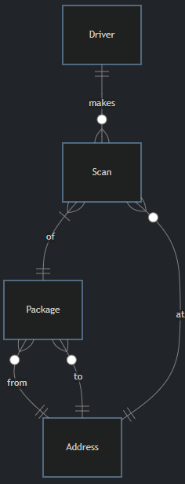

# Packages, Please
## Problem to Solve
You are a mail clerk for the city of Boston and, as such, you oversee the delivery of mail across the city. For the most part, all packages sent are eventually delivered. Except, every once in while, a mystery falls into your lap: a missing package! For each customer that comes to you with a report of a missing package, your job is to determine:

- The current address (or location!) of their missing package
- The type of address or location (e.g. residential, business, etc.)
- The contents of the package
All you know is what the customers themselves will tell you. To solve each mystery, you’ll need to use the mail delivery service’s database, `packages.db`, which contains data on the transit of packages around the city. Using just the information in the database, your task is to help each customer find their missing package.

## Schema
`packages.db` represents all recent package deliveries in the city of Boston. To do so, `packages.db` represents the following entities:

- Drivers, who are the people that deliver packages
- The packages themselves
- Addresses, such as 1234 Main Street
- Scans of packages, which represent confirmations a delivery driver picked up or dropped off a given package
These entities are related per the entity relationship (ER) diagram below:  
  
Within `packages.db`, you’ll find several tables that implement the relationships described in the ER diagram above. Click the drop-downs below to learn more about the schema of each individual table.

<details>
<summary>addresses table</summary>
The `addresses` table contains the following columns:

- `id`, which is the ID of the address
- `address`, which is the street address itself (i.e., 7660 Sharon Street)
- `type`, which is the type of address (i.e., residential, commercial, etc.)
</details>
<details>
<summary>drivers table</summary>
The drivers table contains the following columns:

- `id`, which is the ID of the driver
- `name`, which is the first name of the driver
</details>
<details>
<summary>packages table</summary>
The packages table contains the following columns:

- `id`, which is the ID of the package
- `contents`, which contains the contents of the package
- `from_address_id`, which is the ID of the address from which the package was sent
- `to_address_id`, which is the ID of the address to which the package was sent. It’s not necessarily where it ended up!
</details>
<details>
<summary>scans table</summary>
The scans table contains the following columns:

- `id`, which is the ID of the scan
- `driver_id`, which is the ID of the driver who created the scan
- `package_id`, which is the ID of the package scanned
- `address_id`, which is the ID of the address where the package was scanned
- `action`, which indicates whether the package was picked up (“Pick”) or dropped off (“Drop”)
- `timestamp`, which is the day and time at which the package was scanned
</details>

## Specification
For this problem, equally as important as finding the packages is the process that you use to do so. In `log.sql`, keep a log of all SQL queries that you run on the database. Above each query, label each with a comment: in SQL, comments are any lines that begin with `--`, per the below:

```-- This is a SQL comment```  
The comment should describe why you’re running the query and what information you’re hoping to get out of that particular query. You can use also comments to add additional notes about your thought process as you solve each mystery: ultimately, this file should serve as evidence of the process you used to find each package!

Once you find the location of a package, complete each of the lines in `answers.txt` by filling in details about the location of the package, as well as its contents. Be sure not to change any of the existing text in the file or to add any other lines to the file!

Ultimately, you should submit both your `log.sql` and `answers.txt` files.

## Lost Letter
Your first report of a missing package comes from Anneke. Anneke walks up to your counter and tells you the following:

> Clerk, my name’s Anneke. I live over at 900 Somerville Avenue. Not long ago, I sent out a special letter. It’s meant for my friend Varsha. She’s starting a new chapter of her life at 2 Finnegan Street, uptown. (That address, let me tell you: it was a bit tricky to get right the first time.) The letter is a congratulatory note—a cheery little paper hug from me to her, to celebrate this big move of hers. Can you check if it’s made its way to her yet?

In `log.sql`, underneath `-- *** The Lost Letter ***`, keep track of the SQL queries you use to find Anneke’s lost letter. Once you’ve found it, describe it per the questions in `answers.txt`.

## The Devious Delivery  
Your second report of a missing package comes from a mysterious fellow from out of town. They walk up to your counter and tell you the following:

> Good day to you, deliverer of the mail. You might remember that not too long ago I made my way over from the town of Fiftyville. I gave a certain box into your reliable hands and asked you to keep things low. My associate has been expecting the package for a while now. And yet, it appears to have grown wings and flown away. Ha! Any chance you could help clarify this mystery? Afraid there’s no “From” address. It’s the kind of parcel that would add a bit more… quack to someone’s bath times, if you catch my drift.

In `log.sql`, underneath `-- *** The Devious Delivery ***`, keep track of the SQL queries you use to find the package. Once you’ve found it, describe it per the questions in `answers.txt`.

## The Forgotten Gift  
Your third report of a missing package comes from a grandparent who lives down the street from the post office. They approach your counter and tell you the following:

> Oh, excuse me, Clerk. I had sent a mystery gift, you see, to my wonderful granddaughter, off at 728 Maple Place. That was about two weeks ago. Now the delivery date has passed by seven whole days and I hear she still waits, her hands empty and heart filled with anticipation. I’m a bit worried wondering where my package has gone. I cannot for the life of me remember what’s inside, but I do know it’s filled to the brim with my love for her. Can we possibly track it down so it can fill her day with joy? I did send it from my home at 109 Tileston Street.

In `log.sql`, underneath `-- *** The Forgotten Gift ***`, keep track of the SQL queries you use to find the gift. Once you’ve found it, describe it per the questions in `answers.txt`.