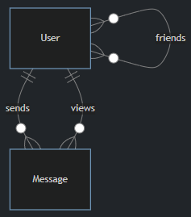

# In a Snap
## Problem to Solve
After the printing press, the postal service, and the telegram came the messaging apps. Chances are you’ve used a messaging app today—whether Facebook Messenger, iMessage, Instagram, Signal or Snapchat, among many others. Whereas their early counterparts measured speed of communication in terms of weeks, days, or hours, messaging apps depend on a kind of speed that’s on the order of milliseconds: a message delayed is now a connection missed.

In this problem, you’ll write SQL queries for a fictional app that allows users to send pictures which expire 30 seconds after the recipient views them (an idea popularized by Snapchat!). The queries you’ll write will ultimately enable the app to implement its core features. Yet, given the app has several thousand users depending on instant communication, it’s especially important to write queries that are fast, not only correct. You’ll practice writing queries that take advantage of indexes, all in the service of letting users stay in touch in a snap.

## Schema


Within `snap.db`, you’ll find three tables that implement the relationships described in the ER diagram above. Click the drop-downs below to learn more about the schema of each individual table.

<details>
<summary>users table</summary>
The `users` table contains the following columns:

- `id`, which is the user’s ID.
- `username`, which is the user’s username.
- `phone_number`, which is the user’s phone number.
- `joined_date`, which is the date the user joined the app.
- `last_login_date`, which is the date the user last logged in.
</details>

<details>
<summary>friends table</summary>
The `friends` table contains the following columns:

- `user_id`, which is the ID of a given user.
- `friend_id`, which is the ID of the user with whom the given user is friends.
- `friendship_date`, which is the date the friendship began.

For each row, the user in the `user_id` column counts the user in the `friend_id` column among their friends—but not necessarily vice versa. When two users both count each other among their friends, two rows are inserted:

|user_id|friend_id|friendship_date|
|-|-|-|
|1|2|2024-01-01|
|2|1|2024-01-01|
</details>

<details>
<summary>messages table</summary>
The `messages` table contains the following columns:

- `id`, which is the ID of the message.
- `from_user_id`, which is the ID of the user who sent the message.
- `to_user_id`, which is the ID of the user to whom the message was sent.
- `picture`, which is the filename of the picture that was sent in the message.
- `sent_timestamp`, which is the timestamp at which the message was sent.
- `viewed_timestamp`, which is the timestamp at which the message was viewed.
- `expires_timestamp`, which is the timestamp at which the message expires.
</details>

## Specification
In each corresponding `.sql` file, write a SQL query to implement the features described below. Since speed is of the essence, you’ll need to also ensure your query uses the specified index. The best way to ensure a query is using an index to check the results of `EXPLAIN QUERY PLAN`.

If feeling unsure how to interpret the output of `EXPLAIN QUERY PLAN`, see the Advice section for some additional explanation!

`1.sql`
The app’s user engagement team needs to identify active users. Find all usernames of users who have logged in since 2024-01-01. Ensure your query uses the `search_users_by_last_login` index, which is defined as follows:
```
CREATE INDEX "search_users_by_last_login"
ON "users"("last_login_date");
```

`2.sql`  
Users need to be prevented from re-opening a message that has expired. Find when the message with ID 151 expires. You may use the message’s ID directly in your query.

Ensure your query uses the index automatically created on the primary key column of the `messages` table.

`3.sql`  
The app needs to rank a user’s “best friends,” similar to Snapchat’s “Friend Emojis” feature. Find the user IDs of the top 3 users to whom `creativewisdom377` sends messages most frequently. Order the user IDs by the number of messages `creativewisdom377` has sent to those users, most to least.

Ensure your query uses the `search_messages_by_from_user_id` index, which is defined as follows:
```
CREATE INDEX "search_messages_by_from_user_id"
ON "messages"("from_user_id");
```

`4.sql`  
The app needs to send users a summary of their engagement. Find the username of the most popular user, defined as the user who has had the most messages sent to them.

Ensure your query uses the `search_messages_by_to_user_id` index, which is defined as follows:
```
CREATE INDEX "search_messages_by_to_user_id"
ON "messages"("to_user_id");
```

`5.sql`  
For any two users, the app needs to quickly show a list of the friends they have in common. Given two usernames, `lovelytrust487` and `exceptionalinspiration482`, find the user IDs of their mutual friends. A mutual friend is a user that both `lovelytrust487` and `exceptionalinspiration482` count among their friends.

Ensure your query uses the index automatically created on primary key columns of the `friends` table. This index is called `sqlite_autoindex_friends_1`.

<details>
<summary>Need a hint?</summary>
Recall that, in SQL, you can use certain keywords to find the intersection of two groups. See Week 1’s notes for a refresher.
</details>

## Advice
<details>
<summary>Use EXPLAIN QUERY PLAN to show a query's steps</summary>
To check the results of `EXPLAIN QUERY PLAN`, you need simply prepend `EXPLAIN QUERY PLAN` to your query:

```
EXPLAIN QUERY PLAN
SELECT "username"
FROM "users"
WHERE "id" = 151;
```
</details>
<details>
<summary>Interpret the results of EXPLAIN QUERY PLAN</summary>

Recall from lecture that `EXPLAIN QUERY PLAN` displays the steps the SQLite database engine will take to execute a given SQL query. The output of `EXPLAIN QUERY PLAN` can indicate whether a query is utilizing an index.

- If you see a step labeled as USING INDEX, it signifies that the query is leveraging an index in that step.
- If you see a step labeled as USING COVERING INDEX, it indicates that the query is using a covering index in that step.
    - Recall that a covering index is a special type of index that includes all the columns needed for the query. This means the database can fulfill the query directly from the index without having to look up additional data in a table.
- When you see a step labeled as `USING INTEGER PRIMARY KEY`, it implies that the query is utilizing the index on the primary key column, which is provided automatically by SQLite when the primary key is of the `INTEGER` type affinity. It is an efficient way to access rows directly if the query conditions involve a table’s primary key.
Below are some examples of the results of `EXPLAIN QUERY PLAN`, from queries that use an index in at least one step of their execution:

# Example 1
```
QUERY PLAN
`--SEARCH users USING INDEX search_users_by_last_login (last_login_date>?)
```

Notice that this query can be executed in a single step, by searching the index `search_users_by_last_login`.

# Example 2
```
QUERY PLAN
|--SEARCH messages USING COVERING INDEX search_messages_by_to_user_id (to_user_id=?)
`--SCALAR SUBQUERY 1
   `--SEARCH users USING COVERING INDEX sqlite_autoindex_users_1 (username=?)
```

Notice that this query requires two steps:

1. The first searches the index `search_messages_by_to_user_id`.
2. The second resolves a subquery by searching the index `sqlite_autoindex_users_1`.

# Example 3
```
QUERY PLAN
|--SEARCH messages USING INDEX search_messages_by_from_user_id (from_user_id=?)
|--SCALAR SUBQUERY 1
|  `--SEARCH users USING COVERING INDEX sqlite_autoindex_users_1 (username=?)
|--USE TEMP B-TREE FOR GROUP BY
`--USE TEMP B-TREE FOR ORDER BY
```

Notice that this query involves several steps, and that it uses indexes to accomplish most:

1. The first step searches the index `search_messages_by_from_user_id`.
2. The second step searches the index `sqlite_autoindex_users_1`.
3. The final steps use temporary B-trees to group and order the results.

# Example 4
```
QUERY PLAN
|--SEARCH users USING INTEGER PRIMARY KEY (rowid=?)
`--SCALAR SUBQUERY 1
   |--SCAN messages USING COVERING INDEX search_messages_by_to_user_id
   `--USE TEMP B-TREE FOR ORDER BY
```

Notice that this query involves several steps, and that it uses indexes to accomplish most:

1. The first step searches an automatic primary key index.
2. The second step scans rows using the index `search_messages_by_to_user_id`.
3. The final step uses a temporary B-tree to order the results.

# Example 5
```
QUERY PLAN
`--COMPOUND QUERY
   |--LEFT-MOST SUBQUERY
   |  |--SEARCH friends USING COVERING INDEX sqlite_autoindex_friends_1 (user_id=?)
   |  `--SCALAR SUBQUERY 1
   |     `--SEARCH users USING COVERING INDEX sqlite_autoindex_users_1 (username=?)
   `--INTERSECT USING TEMP B-TREE
      |--SEARCH friends USING COVERING INDEX sqlite_autoindex_friends_1 (user_id=?)
      `--SCALAR SUBQUERY 3
         `--SEARCH users USING COVERING INDEX sqlite_autoindex_users_1 (username=?)
```
Notice that this query involves many steps, and that it uses indexes to accomplish most. See in particular that the index `sqlite_autoindex_friends_1` is frequently accessed.
</details>