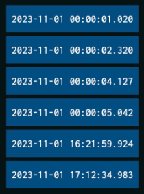
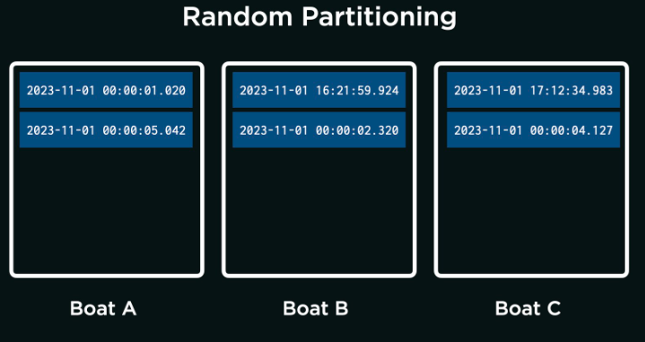
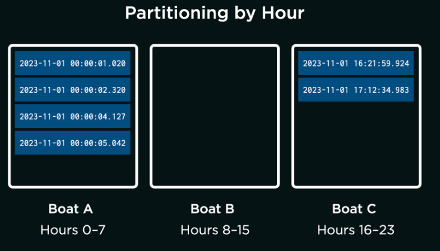
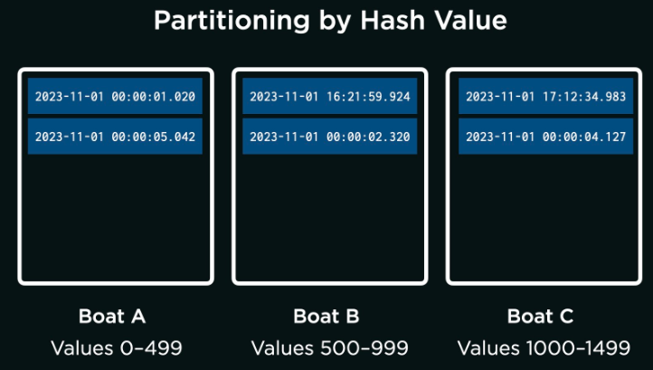

# From the Deep
## Problem to Solve
You are a researcher operating a remote submarine, the AquaByte Explorer, which continuously collects observations from the ocean floor. (AquaByte, though fictional, is a bit like the real SuBastion!). AquaByte sends data up from the deep, storing it in a database located across several boats on the surface of the ocean.

In a file called `answers.md`, your task is to analyze the trade-offs in a few potential designs for AquaByte’s distributed database system!

## Background
AquaByte is capable of sending several thousands of observations per minute, often at particular times of day. For instance, AquaByte most actively observes in the evening and early morning hours, when certain fish can be seen with higher frequency.

Each row of data sent to the surface by AquaByte is tagged with a primary key: in this case, the exact timestamp of the observation in the following format: `YYYY-MM-DD HH:MM:SS.SSS`. This happens to be ISO8601 format, if you’re curious!

## Collecting Observations
For simplicity, suppose AquaByte sent the following 6 observations over the course of November 1st, 2023. For the sake of visualization, each observation is denoted by a blue rectangle labeled by its primary key (the timestamp at which the observation was taken).
  
> As a check for understanding, when did most of AquaByte’s observations occur?

<b>Between midnight and 1am on November 1st, 2023</b>

That's right!

<b>Between noon and 1pm on November 1st, 2023</b>

Not quite.

<b>Between 4pm and 5pm on November 1st, 2023</b>

Not quite.

## Partitions
AquaByte plans to send its six observations to a network of boats on the surface: Boat A, Boat B, and Boat C. More boats allow AquaByte to send more data than any single boat could store. Yet more boats comes at the cost of more complexity: assuming the data, once stored, shouldn’t be moved, to which boat should AquaByte send each observation? This is, in fact, a problem of partitioning the data.

### Random Partitioning
One approach is for AquaByte to randomly send its observations to each boat, as per the below. With the questions below, analyze the technical trade-offs of this design decision.
  

Consider the following two thought questions. Once you have an idea in your head, choose the answer that best corresponds to your thinking by clicking the appropriate dropdown.

> Will the observations likely be evenly distributed across all boats, even if AquaByte most commonly collects observations between midnight and 1am? Why or why not?

<b>The observations will be evenly distributed.</b>

That’s right. The observations will be evenly distributed because each one is randomly assigned to any one of the three boats. Or, put another way, an observation is equally likely to be sent to any boat. So, even if AquaByte most commonly collects observations between midnight and 1am, observations will be evenly spread out among the boats.

<b>The observations will not be evenly distributed.</b>

Not quite. The observations will be evenly distributed because each one is randomly assigned to any one of the three boats. Or, put another way, an observation is equally likely to be sent to any boat. So, even if AquaByte most commonly collects observations between midnight and 1am, observations will be evenly spread out among the boats.

> Suppose a researcher wants to query for all observations between midnight and 1am. On how many of the boats will they need to run the query?

<b>The researcher will need to run the query on all of the boats.</b>

That’s right. Because the observations are randomly assigned to any boat, each observation between midnight and 1am could be on any one of the three boats. If a query is only run on one boat, there’s a chance it has missed observations, stored on other boats, that it should have returned.

<b>The researcher will need to run the query on only some of the boats.</b>

Not quite. Consider that each observation between midnight and 1am is equally likely to be on any one of the three boats. So if the researcher only runs the query on one of the boats, there is a chance the query will have missed observations on other boats.

Based on what you’ve learned from the above, from lecture, and from your own intuition, write 2–3 sentences that describe both reasons to adopt this approach and reasons not to adopt this approach. Write the sentences in answers.md, within the “Random Partitioning” section.

### Partitioning by Hour
Suppose, for the reasons you’ve written, the AquaByte team decides not to have AquaByte randomly send its observations to each boat. Instead, a team member proposes that you partition the data by time of day. For instance,

- Boat A will receive all observations within the hours of 0–7 (i.e., midnight to 7:59 AM), inclusive.
- Boat B will receive all observations within the hours of 8–15 (i.e., 8:00 AM to 3:59 PM), inclusive.
- Boat C will receive all observations within the hours of 16–23 (i.e., 4:00 PM to 11:59 PM), inclusive.

With the questions below, analyze the technical trade-offs of this design decision.
  
Consider the following two thought questions. Once you have an idea in your head, choose the answer that best corresponds to your thinking by clicking the appropriate dropdown.

> Will the observations likely be evenly distributed across all boats, even if AquaByte most commonly collects observations between midnight and 1am? Why or why not?

<b>The observations will be evenly distributed.</b>

Not quite. The observations will not be evenly distributed if AquaByte most commonly collects observations between midnight and 1am. Since most observations are collected between midnight and 1am, and because Boat A will receive all observations within the hours of 0–7 (i.e., midnight to 7:59 AM), inclusive, Boat A will receive most of the observations.

<b>The observations will not be evenly d
istributed.</b>

That’s right. Since most observations are collected between midnight and 1am, and because Boat A will receive all observations within the hours of 0–7 (i.e., midnight to 7:59 AM), inclusive, Boat A will receive most of the observations.

> Suppose a researcher wants to query for all observations between midnight and 1am. On how many of the boats will they need to run the query?

<b>The researcher will need to run the query on a
ll of the boats.</b>

Not quite. Boat A will receive all observations within the hours of 0–7 (i.e., midnight to 7:59 AM), inclusive. This means that all observations between midnight and 1am can be found on Boat A.

<b>The researcher will need to run the query on o
nly some of the boats.</b>

That’s right. Boat A will receive all observations within the hours of 0–7 (i.e., midnight to 7:59 AM), inclusive. This means that all observations between midnight and 1am can be found on Boat A.

Based on what you’ve learned from the above, from lecture, and from your own intuition, write 2–3 sentences that describe both reasons to adopt this approach and reasons not to adopt this approach. Write the sentences in answers.md, within the “Partitioning by Hour” section.

### Partitioning by Hash Value
Suppose, for the reasons you’ve identified above, the AquaByte team decides not to have AquaByte send observations to certain boats depending on the hour in which they were collected. Instead, a team member proposes that you partition the observations by hash value of their timestamp.

If unfamiliar, a hash value is generated by a hash function. A hash function is an algorithm that takes some input (such as a timestamp, for example) and—based on the input—outputs an arbitrary number (the hash value).

For instance, suppose the team develops a hash function that assigns a value between 0 and 1,499, inclusive, to each possible primary key AquaByte could send to the distributed data system. As examples of inputs and outputs:

- The algorithm computes the hash value 45 for `2023-11-01 00:00:01.020`.
- The algorithm computes the hash value 588 for `2023-11-01 16:21:59.924`.
- The algorithm computes the hash value 1200 for `2023-11-01 00:00:04.127`.

Importantly, the hash function is consistent: it will always compute the same hash value when given the same timestamp. The hash function also distributes timestamps evenly across all possible hash values: that is, a single observation is no more likely to be assigned one hash value than another. With the questions below, analyze the technical trade-offs of this design decision.
  
Consider the following three thought questions. Once you have an idea in your head, choose the answer that best corresponds to your thinking by clicking the appropriate dropdown.
> Will the observations likely be evenly distributed across all boats, even if AquaByte most commonly collects observations between midnight and 1am? Why or why not?

<b>The observations will be evenly distributed.</b>

That’s right. A single observation is no more likely to be assigned one hash value than another, which means any single observation could be sent to any one of the three available boats.

<b>The observations will not be evenly distributed.</b>

Not quite. Though AquaByte does most commonly collect observations between midnight and 1am, a single observation is no more likely to be assigned one hash value than another. Any single observation could be sent to any one of the three available boats.

> Suppose a researcher wants to query for all observations between midnight and 1am. On how many of the boats will they need to run the query?

<b>The researcher will likely need to run the query on all of the boats.</b>

That’s right. Each observation in a range of observations could be assigned any arbitrary hash value: the hash values themselves are not in a specified range. For that reason, the query would be best run on all boats.

<b>The researcher will likely need to run the query on only some of the boats.</b>

Not quite. It’s certainly possible to know the hash value of a specific observation. But each observation in a range of observations could be assigned any arbitrary hash value: the hash values themselves are not in a specified range. For that reason, the query would be best run on all boats.

> Suppose a researcher wants to query for a specific observation, which occurred at exactly 2023-11-01 00:00:01.020. On how many of the boats will they need to run the query?

<b>The researcher will need to run the query on all of the boats.</b>

Not quite. It is possible to know the hash value of a specific timestamp, which can tell the researcher where to run the query.

<b>The researcher will need to run the query on only some of the boats.</b>

That’s right. It is possible to know the hash value of a specific timestamp, which can tell the researcher where to run the query.

Based on what you’ve learned from the above, from lecture, and from your own intuition, write 2–3 sentences that describe both reasons to adopt this approach and reasons not to adopt this approach. Write the sentences in answers.md, within the “Partitioning by Hash Value” section.
